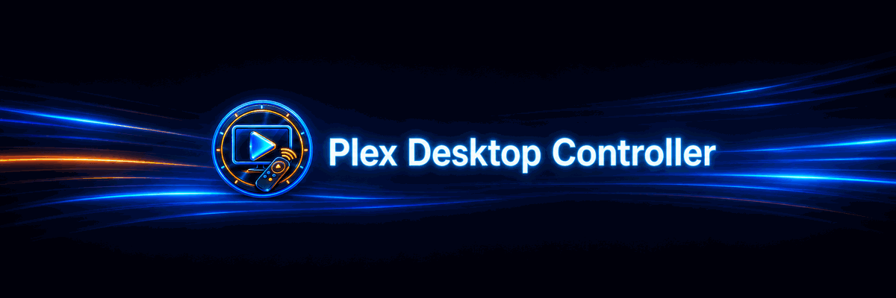

# Plex Desktop Controller



Plex Desktop Controller adds local playback controls for the official **Plex Desktop** Flatpak to StreamController. Put the controls you use most on dedicated keys without entering a Plex server address, account password, or access token.

## Features

- Open Plex Desktop once, or bring its existing window to the front
- Play/pause and stop playback
- Skip backward or forward
- Go to the previous or next playback item
- Toggle mute or fullscreen mode
- Optionally launch Plex automatically when a control is pressed while it is closed
- Assign each command to a short press, long hold, or another supported StreamController key event
- Local-only operation with no Plex credentials or plugin network requests

## Available actions

| Action | What it does |
| --- | --- |
| **Open Plex** | Starts Plex Desktop if needed, otherwise brings its existing window to the front. |
| **Play / Pause** | Toggles playback. |
| **Stop** | Stops the current playback. |
| **Skip Back** | Uses Plex Desktop's backward-seek shortcut. |
| **Skip Forward** | Uses Plex Desktop's forward-seek shortcut. |
| **Previous** | Opens the previous item in the playback queue. |
| **Next** | Opens the next item in the playback queue. |
| **Mute** | Toggles Plex Desktop audio mute. |
| **Fullscreen** | Toggles fullscreen mode. |

## Requirements

- Linux
- StreamController 1.5.0-beta.16 or newer
- [Plex Desktop from Flathub](https://flathub.org/apps/tv.plex.PlexDesktop) (`tv.plex.PlexDesktop`)
- An X11 or XWayland desktop session

Plex Desktop's Flatpak runs through X11/XWayland. The plugin controls only the local Plex Desktop window; it does not control Plex on a television, streaming box, phone, or another computer.

## Install from the StreamController Store

When the plugin is available in the store:

1. Open the **Store** in StreamController.
2. Search for **Plex Desktop Controller**.
3. Select **Install**.
4. Restart StreamController if prompted.

## Manual installation

### Download the ZIP

1. Open the [Plex Desktop Controller GitHub repository](https://github.com/larkum/StreamController-PlexDesktopController).
2. Select **Code**, then **Download ZIP**.
3. Extract the downloaded ZIP.
4. Rename the extracted `StreamController-PlexDesktopController-main` folder to `com_larkum_PlexDesktopController`.
5. Copy that entire folder into StreamController's plugin directory.

For the Flatpak version of StreamController, the finished location must be:

```text
~/.var/app/com.core447.StreamController/data/plugins/com_larkum_PlexDesktopController
```

Make sure `manifest.json` is directly inside `com_larkum_PlexDesktopController`; an extra nested folder will prevent StreamController from finding the plugin. Completely close and reopen StreamController after copying it.

### Install with Git

Alternatively, close StreamController and run:

```bash
git clone https://github.com/larkum/StreamController-PlexDesktopController.git \
  ~/.var/app/com.core447.StreamController/data/plugins/com_larkum_PlexDesktopController
```

Reopen StreamController when the download finishes. To update this installation later, close StreamController and run `git pull` inside the plugin folder.

## Set up a control

1. Add an action from **Plex Desktop Controller** to a StreamController key.
2. Open Plex Desktop and start playing something.
3. Press the assigned key.

For any action except **Open Plex**, enable **Launch Plex if closed** if the button should start Plex automatically before sending its command.

To change the trigger, open the action's event configuration and assign it to a short press, long hold, or another supported key event. This makes it possible to place multiple compatible actions on one physical key.

The exact distance used by **Skip Back** and **Skip Forward** is determined by Plex Desktop's own left/right playback shortcuts.

## How it works

StreamController is normally installed as a Flatpak, while Plex Desktop runs as a separate Flatpak. The plugin uses StreamController's permitted host bridge to locate the local Plex X11/XWayland window, asks the desktop to activate it, sends Plex's standard keyboard command, and then returns focus to the previous window.

No additional Python packages or command-line utilities are required.

## Privacy

Plex Desktop Controller operates locally. It stores no Plex credentials, collects no playback data, and makes no network requests. Plex Desktop itself continues to communicate with Plex services normally.

## Troubleshooting

- **Plex Desktop is not installed:** install the official `tv.plex.PlexDesktop` Flatpak from Flathub.
- **The key shows an error:** make sure Plex Desktop is open and its main window has finished loading, then try again.
- **Nothing happens under KDE Wayland:** accept any desktop prompt that asks whether StreamController may control input, then retry the key.
- **The action cannot find Plex:** confirm that the standard Plex Desktop app is running, not Plexamp or a browser tab.
- **A manual installation does not appear:** check that `manifest.json` is directly inside the `com_larkum_PlexDesktopController` folder, then completely restart StreamController.
- **Skip distance differs from another Plex client:** the desktop app decides the distance associated with its left and right arrow shortcuts.

If the problem continues, [open an issue](https://github.com/larkum/StreamController-PlexDesktopController/issues) and include the StreamController log and your desktop environment.

## Licence and trademark

Plex Desktop Controller is licensed under [GPL-3.0](LICENSE). The icon, banner, and action artwork are original assets created for this project.

Plex is a trademark of Plex, Inc. This independent community plugin is not affiliated with or endorsed by Plex, Inc.
